# Onamae 📛

> Ordered nominal sets implementation written in Scala, a port of the [ons-hs](https://github.com/Jaxan/ons-hs) library.

"Namae (名前)" is a Japanese word that means "name" and the prefix "O (お)" is for honorifics.
So, "Onamae (お名前)" is a honorifics form of "name".
However, here's "**O**" does also mean the abbreviation of "**O**rdered".

## What is this?

This library provides an implementation of ordered nominal sets in the way described in [Venhoek, et al. (2022)], "Fast Computations on Ordered Nominal Sets".
Furthermore, this is a port of Haskell's [ons-hs](https://github.com/Jaxan/ons-hs) library.

[Venhoek, et al. (2022)]: https://www.sciencedirect.com/science/article/abs/pii/S0304397522005291

### Nominal sets

Nominal sets are a way to work with infinite sets in programming.
In particular, nominal sets abstract values ​​as **names** and classify infinite sets by focusing on the relationships between them.
A name is called an **atom** in nominal sets, and the (infinite) set of all atoms is denoted as $\mathbb{A} = \\{ x_1, x_2, \dots \\}$.

> [!NOTE]
> This explanation (intentionally) lacks mathematical formality.
> This is because an understanding of group theory, etc., is not so important for the use of this library.
> If you need a mathematically formal explanation, please refer to books such as [Pitts' book](https://www.cambridge.org/core/books/nominal-sets/80F2B0C1B78A1DC309072CCEDAA88422).

For example, we consider a set of pairs of atoms $\mathbb{A} \times \mathbb{A}$ and show how to classify it into finite values.
This set is infinite, but when we take a pair $(x_1, x_2)$, the relationship between the two atoms (names) can be classified into the following three types: 1) $x_1 = x_2$, 2) $x_1 < x_2$, and 3) $x_1 > x_2$.
Atoms are ordered, so they can be compared to each other.
Therefore, $\mathbb{A} \times \mathbb{A}$ is classified into three categories: 1) $\\{ (x_1, x_2) \mid x_1 = x_2 \\}$, 2) $\\{ (x_1, x_2) \mid x_1 < x_2 \\}$, and 3) $\\{ (x_1, x_2) \mid x_1 > x_2 \\}$.
In addition, when we consider triplet $\mathbb{A} \times \mathbb{A} \times \mathbb{A}$ instead, it is classified into 13 categories.

<details>
  <summary>13 categories of triplet of atoms</summary>

   1. $\\{ (x_1, x_2, x_3) \mid x_1 = x_2 = x_3 \\}$ <!-- (0, 0, 0)-->
   2. $\\{ (x_1, x_2, x_3) \mid x_1 = x_2 < x_3 \\}$ <!-- (0, 0, 1) -->
   3. $\\{ (x_1, x_2, x_3) \mid x_1 = x_3 < x_2 \\}$ <!-- (0, 1, 0) -->
   4. $\\{ (x_1, x_2, x_3) \mid x_1 < x_2 = x_3 \\}$ <!-- (0, 1, 1) -->
   5. $\\{ (x_1, x_2, x_3) \mid x_2 = x_3 < x_1 \\}$ <!-- (1, 0, 0) -->
   6. $\\{ (x_1, x_2, x_3) \mid x_2 < x_1 = x_3 \\}$ <!-- (1, 0, 1) -->
   7. $\\{ (x_1, x_2, x_3) \mid x_3 < x_1 = x_2 \\}$ <!-- (1, 1, 0) -->
   8. $\\{ (x_1, x_2, x_3) \mid x_1 < x_2 < x_3 \\}$ <!-- (0, 1, 2) -->
   9. $\\{ (x_1, x_2, x_3) \mid x_1 < x_3 < x_2 \\}$ <!-- (0, 2, 1) -->
  10. $\\{ (x_1, x_2, x_3) \mid x_2 < x_1 < x_3 \\}$ <!-- (1, 0, 2) -->
  11. $\\{ (x_1, x_2, x_3) \mid x_3 < x_1 < x_2 \\}$ <!-- (1, 2, 0) -->
  12. $\\{ (x_1, x_2, x_3) \mid x_2 < x_3 < x_1 \\}$ <!-- (2, 0, 1) -->
  13. $\\{ (x_1, x_2, x_3) \mid x_3 < x_2 < x_1 \\}$ <!-- (2, 1, 0) -->
</details>

These categories are called **orbits** in nominal sets.
In nominal sets, by managing orbits internally rather than infinite values, it allows infinite sets to be treated as if they were finite sets.

Now, let's try to see how the program can actually handle an infinite set.

```scala
import onamae.*

// `NSet` is a main data structure introduced by Onamae. We can use this value
// much like `scala.collection.Set`, but it can be treated as if it holds infinite values.
val allAtoms: NSet[Atom] = NSet.atoms

// `allAtoms` contains every atom.
allAtoms.contains(Atom(0))   // => true
allAtoms.contains(Atom(1))   // => true
allAtoms.contains(Atom(100)) // => true

// `distinctPairs` are a set of pairs of distinct atoms, i.e., { (x, y) | x != y }.
// We can use `filter` for `NSet`s.
val distinctPairs: NSet[(Atom, Atom)] =
  NSet.product(NSet.atoms, NSet.atoms).filter(_ != _)

distinctPairs.contains((Atom(0), Atom(1))) // => true
distinctPairs.contains((Atom(1), Atom(0))) // => true
distinctPairs.contains((Atom(0), Atom(0))) // => false

// `distinctPairs.contains` also works for every atom.
distinctPairs.contains((Atom(100), Atom(200))) // => true
distinctPairs.contains((Atom(100), Atom(100))) // => false
```

### $\nu L^\ast$ (automata learning)

Automata learning is one of the important applications of nominal sets.
We can consider **nominal automata** and extend automata theory to nominal sets.
Nominal automata can have an infinite alphabet and infinite number of states, making them more powerful than finite-state automata.

For example, a language $L_{aa} = \\{ a a \mid a \in \mathbb{A} \\}$, in which the same letter is repeated twice, cannot be accepted by finite-state automata because it requires an infinite number of states when the alphabet is infinite.
The following transition diagram shows a nominal DFA accepting $L_{aa}$.
The middle state $q_x$ is subscripted with a variable $x$ and is considered to be infinite.
That is, the set of state of this DFA is $\\{ q_0, q_1, q_2 \\} \cup \\{ q_x \mid x \in \mathbb{A} \\}$.

```mermaid
flowchart LR
  q0(("q0"))
  qx(("qx"))
  q1((("q1")))
  q2(("q2"))

  q1 -- "a" --> q2

  q0 -- "x = a" --> qx
  qx -- "x = a" --> q1
  qx -- "x ≠ a" --> q2
```



Automata learning is an algorithm for inferring DFA from a black-box **teacher** system.
The algorithm extended to nominal DFA is known as $\nu L^\ast$.

Onamae implements nominal automata and $\nu L^\ast$ in the `onamae.automaton` namespace and is easy to use.

```scala
import onamae.*
import onamae.automaton.*

// `NDFA` is a type of nominal DFAs.
// `NDFA.ww(1)` returns a DFA accepts $L_{aa}$.
val Laa = NDFA.ww(1)

// Once the teacher is created from a DFA and passed to `LStar.learn`,
// the learning is executed.
val teacher = Teacher.fromDFA(Laa)
val inferred = LStar.learn(teacher)

// `inferred` is a DFA accepts $L_{aa}$, so the separating word between them
// are not found, i.e., they are equivalent.
NDFA.findSepWord(Laa, inferred) // => None
```

For more details on the $\nu L^\ast$ algorithm, please refer to [Moerman, et al. (2017)].

[Moerman, et al. (2017)]: https://dl.acm.org/doi/10.1145/3093333.3009879

## License

This library is released under the MIT license. See the [LICENSE](./LICENSE) file.

Copyright (c) 2024, Hiroya Fujinami
